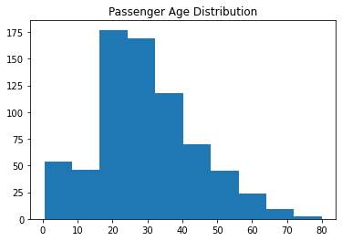
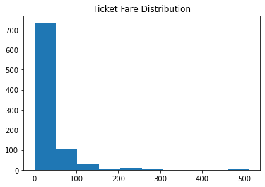
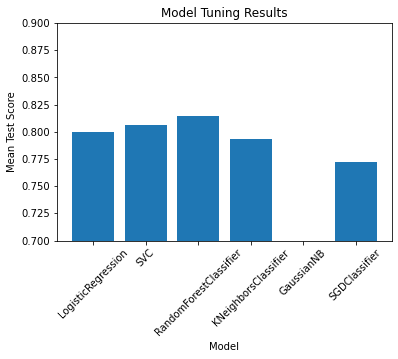
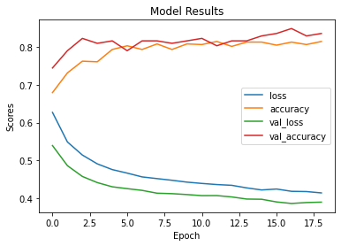

# Dataset Description
### Overview
The data has been split into two groups:
* training set (train.csv)
* test set (test.csv)

**The training set** should be used to build your machine learning models. For the training set, we provide the outcome (also known as the “ground truth”) for each passenger. Your model will be based on “features” like passengers’ gender and class. You can also use *feature engineering* to create new features.

**The test set** should be used to see how well your model performs on unseen data. For the test set, we do not provide the ground truth for each passenger. It is your job to predict these outcomes. For each passenger in the test set, use the model you trained to predict whether or not they survived the sinking of the Titanic.

We also include **gender_submission.csv**, a set of predictions that assume all and only female passengers survive, as an example of what a submission file should look like.

Data Dictionary

| Variable |                 Definition                 |                       Key                      |
|:---------|:-------------------------------------------|:-----------------------------------------------|
| survival | Survival                                   | 0 = No, 1 = Yes                                |
| pclass   | Ticket class                               | 1 = 1st, 2 = 2nd, 3 = 3rd                      |
| sex      | Sex                                        |                                                |
| Age      | Age in years                               |                                                |
| sibsp    | # of siblings / spouses aboard the Titanic |                                                |
| parch    | # of parents / children aboard the Titanic |                                                |
| ticket   | Ticket number                              |                                                |
| fare     | Passenger fare                             |                                                |
| cabin    | Cabin number                               |                                                |
| embarked | Port of Embarkation                        | C = Cherbourg, Q = Queenstown, S = Southampton |

### Variable Notes
**pclass**: A proxy for socio-economic status (SES) <br>
1st = Upper <br>
2nd = Middle <br>
3rd = Lower <br>

**age**: Age is fractional if less than 1. If the age is estimated, is it in the form of xx.5

**sibsp**: The dataset defines family relations in this way...
Sibling = brother, sister, stepbrother, stepsister
Spouse = husband, wife (mistresses and fiancés were ignored)

**parch**: The dataset defines family relations in this way...
Parent = mother, father
Child = daughter, son, stepdaughter, stepson
Some children travelled only with a nanny, therefore parch=0 for them.

source:
https://www.kaggle.com/competitions/titanic
<br><br><br><br>

### Import libraries


```python
import pandas as pd
import numpy as np
import matplotlib.pyplot as plt
import seaborn as sns
import warnings
warnings.filterwarnings('ignore')
```

### Load data


```python
train = pd.read_csv('train.csv').copy()
test = pd.read_csv('test.csv').copy()
```

### Data Cleaning and Proprocessing


```python
numerical_features = ['age', 'fare']
categorical_features = ['pclass', 'sex', 'sibsp', 'parch', 'embarked']
removeable_features = ['passengerid', 'name', 'ticket', 'cabin']
```


```python
# See Nan values
train.isna().sum()
```


    PassengerId      0
    Survived         0
    Pclass           0
    Name             0
    Sex              0
    Age            177
    SibSp            0
    Parch            0
    Ticket           0
    Fare             0
    Cabin          687
    Embarked         2
    dtype: int64


```python
# Rename columns name into lowercase
train.columns = [x.lower() for x in train.columns]
```


```python
# Looking inside 'age' distribution
plt.hist(train.age)
plt.title('Passenger Age Distribution')
plt.show()


print('Age mean: {}'.format(train.age.mean()))
print('Age median: {}'.format(train.age.median()))
print('Age mode: {}'.format(train.age.mode()))


```


    

    


    Age mean: 29.69911764705882
    Age median: 28.0
    Age mode: 0    24.0
    dtype: float64
    


```python
# Looking inside 'fare' distribution
plt.hist(train.fare)
plt.title('Ticket Fare Distribution')
plt.show()

print('fare mean: {}'.format(train.fare.mean()))
print('fare median: {}'.format(train.fare.median()))
print('fare mode: {}'.format(train.fare.mode()))

```


    

    


    fare mean: 32.2042079685746
    fare median: 14.4542
    fare mode: 0    8.05
    dtype: float64
    


```python
# Rename columns name into lowercase
def rename_cols(df):
    df.columns = [x.lower() for x in df.columns]
    return df
```


```python
# Remove unwanted columns
def remove_unwanted_cols(df):
    df = df.drop(labels=removeable_features, axis=1)
    return df
```


```python
# Filter out outliers
def filter_outlier(df):
    # Select the columns to filter out outliers
    cols_to_filter = numerical_features

    # Calculate the quartiles and interquartile range
    Q1 = df[cols_to_filter].quantile(0.25)
    Q3 = df[cols_to_filter].quantile(0.75)
    IQR = Q3 - Q1

    # Set the lower and upper thresholds
    lower_threshold = Q1 - 1.5 * IQR
    upper_threshold = Q3 + 1.5 * IQR

    # Filter the df
    df = df[~((df[cols_to_filter] < lower_threshold) | (df[cols_to_filter] > upper_threshold)).any(axis=1)]
    
    return df
```


```python
def imputer(df):
    # Missing values imputer
    from sklearn.impute import SimpleImputer

    # Create an imputer object with median strategy
    imputer = SimpleImputer(strategy='median')

    # Fit the imputer object on the age column
    imputer.fit(df[numerical_features])

    # Transform the age column
    df[numerical_features] = imputer.transform(df[numerical_features])

    return df
```


```python
# Apply One-hot encode
def one_hot(df):
    # Transform categorical features into dummies variables
    df = pd.get_dummies(data=df, columns=categorical_features, drop_first=True)
    return df
```


```python
def scaler(df):
    
    from sklearn.preprocessing import StandardScaler

    # Create standardscaler instace
    scaler = StandardScaler()

    # Fit the instace on the selected columns
    scaler.fit(df[numerical_features])

    # Transform the selected columns
    df[numerical_features] = scaler.transform(df[numerical_features])
    
    return df
```

### Machine Learning


```python
# Performing hyperparameter tuning
def grid_search():
    from sklearn.neighbors import KNeighborsClassifier
    from sklearn.naive_bayes import GaussianNB
    from sklearn.linear_model import SGDClassifier
    from sklearn.model_selection import GridSearchCV, cross_val_score
    from sklearn.ensemble import RandomForestClassifier
    from sklearn.linear_model import LogisticRegression
    from sklearn.svm import SVC

    # Load the data
    X_train, y_train = train.drop('survived', axis=1), train.survived

    # Define the models to be used
    models = {
        'LogisticRegression': LogisticRegression(),
        'SVC': SVC(),
        'RandomForestClassifier': RandomForestClassifier(),
        'KNeighborsClassifier': KNeighborsClassifier(),
        'GaussianNB': GaussianNB(),
        'SGDClassifier': SGDClassifier()
    }

    # Define the hyperparameters to be tuned
    hyperparameters = {
        'LogisticRegression': {'C': [0.1, 1, 10], 'penalty': ['l2']},
        'SVC': {'C': [0.1, 1, 10], 'kernel': ['linear', 'rbf']},
        'RandomForestClassifier': {'n_estimators': [50, 100, 200], 'max_depth': [None, 5, 10]},
        'KNeighborsClassifier': {'n_neighbors': [20, 40, 80], 'weights': ['uniform', 'distance']},
        'GaussianNB': {},
        'SGDClassifier': {'loss': ['hinge', 'log_loss'], 'penalty': ['l1', 'l2', 'elasticnet']}
    }

    # Train and tune each model using GridSearchCV
    for model_name, model in models.items():
        gs = GridSearchCV(model, hyperparameters[model_name], cv=5, verbose=0)
        gs.fit(X_train, y_train)
        models[model_name] = gs

    # Evaluate the models on the test set
    for model_name, gs in models.items():
        # Best score for each model
        print(f'{model_name} best score: {gs.best_score_:.2f}')
    print()
    
    for model_name, gs in models.items():
        # Best parameters for each model
        print(f'{model_name} best params: {gs.best_params_}')
    print()
        
    for model_name, gs in models.items():
        cv_score = cross_val_score(gs, X_train, y_train, cv=5)
        print(f"{model_name} Regression Accuracy: {cv_score.mean():.2f} (+/- {cv_score.std():.2f})")

    for model_name, gs in models.items():
        # Best score for each model
        models[model_name] = gs.best_score_   
        
    # Get the list of models and their corresponding best scores
    model_names = list(models.keys())
    best_scores = list(list(models.values()))

    # Create a bar chart
    plt.bar(model_names, best_scores)
    plt.xlabel("Model")
    plt.ylabel("Mean Test Score")
    plt.title("Model Tuning Results")
    plt.xticks(rotation=45)
    plt.ylim(0.7, 0.9)
    plt.show()
```


```python
import time
start_time = time.time()

# Load data
train = pd.read_csv('train.csv').copy()
test = pd.read_csv('test.csv').copy()

# Data cleaning and preprocessing
train = rename_cols(train)
train = remove_unwanted_cols(train)
train = filter_outlier(train)
train = imputer(train)
train = one_hot(train)
train = scaler(train)

# Performing hyperparameter tuning
grid_search()

end_time = time.time()
time_elapsed = end_time - start_time
print("Time elapsed: ", time_elapsed)
```

    LogisticRegression best score: 0.80
    SVC best score: 0.81
    RandomForestClassifier best score: 0.81
    KNeighborsClassifier best score: 0.79
    GaussianNB best score: 0.37
    SGDClassifier best score: 0.77
    
    LogisticRegression best params: {'C': 10, 'penalty': 'l2'}
    SVC best params: {'C': 1, 'kernel': 'rbf'}
    RandomForestClassifier best params: {'max_depth': 5, 'n_estimators': 100}
    KNeighborsClassifier best params: {'n_neighbors': 20, 'weights': 'uniform'}
    GaussianNB best params: {}
    SGDClassifier best params: {'loss': 'log_loss', 'penalty': 'elasticnet'}
    
    LogisticRegression Regression Accuracy: 0.79 (+/- 0.02)
    SVC Regression Accuracy: 0.81 (+/- 0.01)
    RandomForestClassifier Regression Accuracy: 0.81 (+/- 0.03)
    KNeighborsClassifier Regression Accuracy: 0.79 (+/- 0.03)
    GaussianNB Regression Accuracy: 0.37 (+/- 0.01)
    SGDClassifier Regression Accuracy: 0.77 (+/- 0.04)
    


    

    


    Time elapsed:  127.36362862586975
    


```python
def run_models(gen=False):
    # Model training, predict, and evaluate
    import numpy as np
    from sklearn.model_selection import train_test_split
    from sklearn.metrics import accuracy_score, precision_score, recall_score
    from sklearn.linear_model import LogisticRegression
    from sklearn.svm import SVC
    from sklearn.ensemble import RandomForestClassifier

    # Load the data
    X_train, y_train = train.drop('survived', axis=1), train.survived
    X_test = test
    
    # Initialize the models
    models = {'Logistic Regression': LogisticRegression(C=10, fit_intercept=True, max_iter=100, penalty='l2'),
              'Support Vector Machine': SVC(C=1, kernel='rbf'),
              'Random Forest': RandomForestClassifier(criterion='entropy', n_estimators=50, max_depth=10, random_state=21)}

    # Iterate over the models
    for name, model in models.items():
        # Train the model
        model.fit(X_train, y_train)
        
        # Predict on the test set
        y_pred = model.predict(X_test)
       
        if gen == False :
            pass
        else:
            # Create .csv predict result
            result_dict = {'PassengerId':pd.read_csv('test.csv').copy().PassengerId,
                           'Survived': y_pred}
            df = pd.DataFrame(result_dict)
            df.to_csv('{}.csv'.format(name),index=False)
            print("Create .csv Model: {} --> Done".format(name))
            print()
        
```


```python
# Load data
train = pd.read_csv('train.csv').copy()
test = pd.read_csv('test.csv').copy()

# Data cleaning and preprocessing
train = rename_cols(train)
train = remove_unwanted_cols(train)
train = filter_outlier(train)
train = imputer(train)
train = one_hot(train)
train = scaler(train)
test = rename_cols(test)
test = remove_unwanted_cols(test)
test = imputer(test)
test = one_hot(test)
test = scaler(test)
test = test.drop(['sibsp_8', 'parch_9'], axis=1)

# Train and elevauate the model
run_models(gen=False) # gen=True will return predicted result as .csv file
```

# Neural Network


```python
train.head()
```


<div>
<style scoped>
    .dataframe tbody tr th:only-of-type {
        vertical-align: middle;
    }

    .dataframe tbody tr th {
        vertical-align: top;
    }

    .dataframe thead th {
        text-align: right;
    }
</style>
<table border="1" class="dataframe">
  <thead>
    <tr style="text-align: right;">
      <th></th>
      <th>survived</th>
      <th>age</th>
      <th>fare</th>
      <th>pclass_2</th>
      <th>pclass_3</th>
      <th>sex_male</th>
      <th>sibsp_1</th>
      <th>sibsp_2</th>
      <th>sibsp_3</th>
      <th>sibsp_4</th>
      <th>sibsp_5</th>
      <th>parch_1</th>
      <th>parch_2</th>
      <th>parch_3</th>
      <th>parch_4</th>
      <th>parch_5</th>
      <th>parch_6</th>
      <th>embarked_Q</th>
      <th>embarked_S</th>
    </tr>
  </thead>
  <tbody>
    <tr>
      <th>0</th>
      <td>0</td>
      <td>-0.519955</td>
      <td>-0.778143</td>
      <td>0</td>
      <td>1</td>
      <td>1</td>
      <td>1</td>
      <td>0</td>
      <td>0</td>
      <td>0</td>
      <td>0</td>
      <td>0</td>
      <td>0</td>
      <td>0</td>
      <td>0</td>
      <td>0</td>
      <td>0</td>
      <td>0</td>
      <td>1</td>
    </tr>
    <tr>
      <th>2</th>
      <td>1</td>
      <td>-0.185188</td>
      <td>-0.728035</td>
      <td>0</td>
      <td>1</td>
      <td>0</td>
      <td>0</td>
      <td>0</td>
      <td>0</td>
      <td>0</td>
      <td>0</td>
      <td>0</td>
      <td>0</td>
      <td>0</td>
      <td>0</td>
      <td>0</td>
      <td>0</td>
      <td>0</td>
      <td>1</td>
    </tr>
    <tr>
      <th>3</th>
      <td>1</td>
      <td>0.568037</td>
      <td>2.625508</td>
      <td>0</td>
      <td>0</td>
      <td>0</td>
      <td>1</td>
      <td>0</td>
      <td>0</td>
      <td>0</td>
      <td>0</td>
      <td>0</td>
      <td>0</td>
      <td>0</td>
      <td>0</td>
      <td>0</td>
      <td>0</td>
      <td>0</td>
      <td>1</td>
    </tr>
    <tr>
      <th>4</th>
      <td>0</td>
      <td>0.568037</td>
      <td>-0.718755</td>
      <td>0</td>
      <td>1</td>
      <td>1</td>
      <td>0</td>
      <td>0</td>
      <td>0</td>
      <td>0</td>
      <td>0</td>
      <td>0</td>
      <td>0</td>
      <td>0</td>
      <td>0</td>
      <td>0</td>
      <td>0</td>
      <td>0</td>
      <td>1</td>
    </tr>
    <tr>
      <th>5</th>
      <td>0</td>
      <td>-0.017805</td>
      <td>-0.688445</td>
      <td>0</td>
      <td>1</td>
      <td>1</td>
      <td>0</td>
      <td>0</td>
      <td>0</td>
      <td>0</td>
      <td>0</td>
      <td>0</td>
      <td>0</td>
      <td>0</td>
      <td>0</td>
      <td>0</td>
      <td>0</td>
      <td>1</td>
      <td>0</td>
    </tr>
  </tbody>
</table>
</div>


```python
train.shape
```


    (765, 19)


```python
test
```


<div>
<style scoped>
    .dataframe tbody tr th:only-of-type {
        vertical-align: middle;
    }

    .dataframe tbody tr th {
        vertical-align: top;
    }

    .dataframe thead th {
        text-align: right;
    }
</style>
<table border="1" class="dataframe">
  <thead>
    <tr style="text-align: right;">
      <th></th>
      <th>age</th>
      <th>fare</th>
      <th>pclass_2</th>
      <th>pclass_3</th>
      <th>sex_male</th>
      <th>sibsp_1</th>
      <th>sibsp_2</th>
      <th>sibsp_3</th>
      <th>sibsp_4</th>
      <th>sibsp_5</th>
      <th>parch_1</th>
      <th>parch_2</th>
      <th>parch_3</th>
      <th>parch_4</th>
      <th>parch_5</th>
      <th>parch_6</th>
      <th>embarked_Q</th>
      <th>embarked_S</th>
    </tr>
  </thead>
  <tbody>
    <tr>
      <th>0</th>
      <td>0.386231</td>
      <td>-0.497413</td>
      <td>0</td>
      <td>1</td>
      <td>1</td>
      <td>0</td>
      <td>0</td>
      <td>0</td>
      <td>0</td>
      <td>0</td>
      <td>0</td>
      <td>0</td>
      <td>0</td>
      <td>0</td>
      <td>0</td>
      <td>0</td>
      <td>1</td>
      <td>0</td>
    </tr>
    <tr>
      <th>1</th>
      <td>1.371370</td>
      <td>-0.512278</td>
      <td>0</td>
      <td>1</td>
      <td>0</td>
      <td>1</td>
      <td>0</td>
      <td>0</td>
      <td>0</td>
      <td>0</td>
      <td>0</td>
      <td>0</td>
      <td>0</td>
      <td>0</td>
      <td>0</td>
      <td>0</td>
      <td>0</td>
      <td>1</td>
    </tr>
    <tr>
      <th>2</th>
      <td>2.553537</td>
      <td>-0.464100</td>
      <td>1</td>
      <td>0</td>
      <td>1</td>
      <td>0</td>
      <td>0</td>
      <td>0</td>
      <td>0</td>
      <td>0</td>
      <td>0</td>
      <td>0</td>
      <td>0</td>
      <td>0</td>
      <td>0</td>
      <td>0</td>
      <td>1</td>
      <td>0</td>
    </tr>
    <tr>
      <th>3</th>
      <td>-0.204852</td>
      <td>-0.482475</td>
      <td>0</td>
      <td>1</td>
      <td>1</td>
      <td>0</td>
      <td>0</td>
      <td>0</td>
      <td>0</td>
      <td>0</td>
      <td>0</td>
      <td>0</td>
      <td>0</td>
      <td>0</td>
      <td>0</td>
      <td>0</td>
      <td>0</td>
      <td>1</td>
    </tr>
    <tr>
      <th>4</th>
      <td>-0.598908</td>
      <td>-0.417492</td>
      <td>0</td>
      <td>1</td>
      <td>0</td>
      <td>1</td>
      <td>0</td>
      <td>0</td>
      <td>0</td>
      <td>0</td>
      <td>1</td>
      <td>0</td>
      <td>0</td>
      <td>0</td>
      <td>0</td>
      <td>0</td>
      <td>0</td>
      <td>1</td>
    </tr>
    <tr>
      <th>...</th>
      <td>...</td>
      <td>...</td>
      <td>...</td>
      <td>...</td>
      <td>...</td>
      <td>...</td>
      <td>...</td>
      <td>...</td>
      <td>...</td>
      <td>...</td>
      <td>...</td>
      <td>...</td>
      <td>...</td>
      <td>...</td>
      <td>...</td>
      <td>...</td>
      <td>...</td>
      <td>...</td>
    </tr>
    <tr>
      <th>413</th>
      <td>-0.204852</td>
      <td>-0.493455</td>
      <td>0</td>
      <td>1</td>
      <td>1</td>
      <td>0</td>
      <td>0</td>
      <td>0</td>
      <td>0</td>
      <td>0</td>
      <td>0</td>
      <td>0</td>
      <td>0</td>
      <td>0</td>
      <td>0</td>
      <td>0</td>
      <td>0</td>
      <td>1</td>
    </tr>
    <tr>
      <th>414</th>
      <td>0.740881</td>
      <td>1.314435</td>
      <td>0</td>
      <td>0</td>
      <td>0</td>
      <td>0</td>
      <td>0</td>
      <td>0</td>
      <td>0</td>
      <td>0</td>
      <td>0</td>
      <td>0</td>
      <td>0</td>
      <td>0</td>
      <td>0</td>
      <td>0</td>
      <td>0</td>
      <td>0</td>
    </tr>
    <tr>
      <th>415</th>
      <td>0.701476</td>
      <td>-0.507796</td>
      <td>0</td>
      <td>1</td>
      <td>1</td>
      <td>0</td>
      <td>0</td>
      <td>0</td>
      <td>0</td>
      <td>0</td>
      <td>0</td>
      <td>0</td>
      <td>0</td>
      <td>0</td>
      <td>0</td>
      <td>0</td>
      <td>0</td>
      <td>1</td>
    </tr>
    <tr>
      <th>416</th>
      <td>-0.204852</td>
      <td>-0.493455</td>
      <td>0</td>
      <td>1</td>
      <td>1</td>
      <td>0</td>
      <td>0</td>
      <td>0</td>
      <td>0</td>
      <td>0</td>
      <td>0</td>
      <td>0</td>
      <td>0</td>
      <td>0</td>
      <td>0</td>
      <td>0</td>
      <td>0</td>
      <td>1</td>
    </tr>
    <tr>
      <th>417</th>
      <td>-0.204852</td>
      <td>-0.236957</td>
      <td>0</td>
      <td>1</td>
      <td>1</td>
      <td>1</td>
      <td>0</td>
      <td>0</td>
      <td>0</td>
      <td>0</td>
      <td>1</td>
      <td>0</td>
      <td>0</td>
      <td>0</td>
      <td>0</td>
      <td>0</td>
      <td>0</td>
      <td>0</td>
    </tr>
  </tbody>
</table>
<p>418 rows × 18 columns</p>
</div>


```python
print(train.shape)
print(test.shape)
```

    (765, 19)
    (418, 18)
    


```python
import tensorflow as tf
from tensorflow.keras.callbacks import EarlyStopping

tf.random.set_seed(42)


X_train = train.drop('survived', axis=1)
y_train = train.survived

early_stopping = EarlyStopping(patience=2)

# Define the model
model = tf.keras.Sequential([
    tf.keras.layers.Dense(64, activation='relu', input_shape=(18,)),
    tf.keras.layers.Dense(64, activation='relu'),

    tf.keras.layers.Dense(1, activation='sigmoid')
])

# Compile the model
model.compile(optimizer='adam',
              loss='binary_crossentropy',
              metrics=['accuracy'])

# Train the model
history = model.fit(X_train, y_train,
                    epochs=30,
                    batch_size=32,
                    validation_split=0.2,
                    callbacks=early_stopping)

import matplotlib.pyplot as plt

results =  history.history
# Plot the accuracy history
# plot each line in the dictionary
for key in results:
    plt.plot(results[key], label=key)
    
    
# Plot a model results    
plt.title('Model Results')
plt.ylabel('Scores')
plt.xlabel('Epoch')
plt.legend(list(results.keys()))
plt.show()

print(max(history.history['val_accuracy']))
```

    Epoch 1/30
    20/20 [==============================] - 1s 24ms/step - loss: 0.6271 - accuracy: 0.6797 - val_loss: 0.5392 - val_accuracy: 0.7451
    Epoch 2/30
    20/20 [==============================] - 0s 6ms/step - loss: 0.5487 - accuracy: 0.7320 - val_loss: 0.4858 - val_accuracy: 0.7908
    Epoch 3/30
    20/20 [==============================] - 0s 8ms/step - loss: 0.5141 - accuracy: 0.7631 - val_loss: 0.4572 - val_accuracy: 0.8235
    Epoch 4/30
    20/20 [==============================] - 0s 6ms/step - loss: 0.4907 - accuracy: 0.7614 - val_loss: 0.4410 - val_accuracy: 0.8105
    Epoch 5/30
    20/20 [==============================] - 0s 7ms/step - loss: 0.4755 - accuracy: 0.7941 - val_loss: 0.4298 - val_accuracy: 0.8170
    Epoch 6/30
    20/20 [==============================] - 0s 6ms/step - loss: 0.4661 - accuracy: 0.8039 - val_loss: 0.4249 - val_accuracy: 0.7908
    Epoch 7/30
    20/20 [==============================] - 0s 6ms/step - loss: 0.4560 - accuracy: 0.7941 - val_loss: 0.4203 - val_accuracy: 0.8170
    Epoch 8/30
    20/20 [==============================] - 0s 7ms/step - loss: 0.4515 - accuracy: 0.8088 - val_loss: 0.4128 - val_accuracy: 0.8170
    Epoch 9/30
    20/20 [==============================] - 0s 7ms/step - loss: 0.4471 - accuracy: 0.7941 - val_loss: 0.4116 - val_accuracy: 0.8105
    Epoch 10/30
    20/20 [==============================] - 0s 7ms/step - loss: 0.4422 - accuracy: 0.8088 - val_loss: 0.4092 - val_accuracy: 0.8170
    Epoch 11/30
    20/20 [==============================] - 0s 7ms/step - loss: 0.4387 - accuracy: 0.8072 - val_loss: 0.4063 - val_accuracy: 0.8235
    Epoch 12/30
    20/20 [==============================] - 0s 7ms/step - loss: 0.4358 - accuracy: 0.8154 - val_loss: 0.4065 - val_accuracy: 0.8039
    Epoch 13/30
    20/20 [==============================] - 0s 8ms/step - loss: 0.4337 - accuracy: 0.8023 - val_loss: 0.4029 - val_accuracy: 0.8170
    Epoch 14/30
    20/20 [==============================] - 0s 7ms/step - loss: 0.4269 - accuracy: 0.8137 - val_loss: 0.3973 - val_accuracy: 0.8170
    Epoch 15/30
    20/20 [==============================] - 0s 7ms/step - loss: 0.4214 - accuracy: 0.8137 - val_loss: 0.3967 - val_accuracy: 0.8301
    Epoch 16/30
    20/20 [==============================] - 0s 6ms/step - loss: 0.4239 - accuracy: 0.8056 - val_loss: 0.3896 - val_accuracy: 0.8366
    Epoch 17/30
    20/20 [==============================] - 0s 6ms/step - loss: 0.4178 - accuracy: 0.8137 - val_loss: 0.3856 - val_accuracy: 0.8497
    Epoch 18/30
    20/20 [==============================] - 0s 7ms/step - loss: 0.4172 - accuracy: 0.8072 - val_loss: 0.3880 - val_accuracy: 0.8301
    Epoch 19/30
    20/20 [==============================] - 0s 7ms/step - loss: 0.4136 - accuracy: 0.8154 - val_loss: 0.3891 - val_accuracy: 0.8366
    


    

    


    0.8496732115745544
    


```python
from sklearn.model_selection import GridSearchCV
from keras.wrappers.scikit_learn import KerasClassifier
from keras.models import Sequential
from keras.layers import Dense
import tensorflow as tf

import warnings
warnings.filterwarnings('ignore') # Hide all warnings

tf.random.set_seed(42)

# Load input data
X_train = train.drop('survived', axis=1)
y_train = train.survived

batch_size = [32,64,128]
epochs = [15,20,25]
optimizer = ['adam']
cv = 5 # None mean default (K-fold=5)

def create_model(optimizer):
    model = Sequential()
    model.add(Dense(64, activation='relu', input_shape=(18,)))
    model.add(Dense(64, activation='relu'))
    model.add(Dense(1, activation='sigmoid'))
    model.compile(loss='binary_crossentropy', optimizer=optimizer, metrics=['accuracy'])
    return model


model = KerasClassifier(build_fn=create_model)

param_grid = {'batch_size': batch_size,
              'epochs': epochs,
              'optimizer': optimizer,}


grid = GridSearchCV(estimator=model, param_grid=param_grid, cv=cv) 
grid_result = grid.fit(X_train,y_train, verbose=0)

print("Best: %f using %s" % (grid_result.best_score_, grid_result.best_params_))
means = grid_result.cv_results_['mean_test_score']
stds = grid_result.cv_results_['std_test_score']
params = grid_result.cv_results_['params']
for mean, stdev, param in zip(means, stds, params):
    print("%f (%f) with: %r" % (mean, stdev, param))
```

    5/5 [==============================] - 0s 5ms/step - loss: 0.4827 - accuracy: 0.7582
    5/5 [==============================] - 0s 3ms/step - loss: 0.5230 - accuracy: 0.7974
    5/5 [==============================] - 0s 4ms/step - loss: 0.4169 - accuracy: 0.8105
    5/5 [==============================] - 0s 3ms/step - loss: 0.4757 - accuracy: 0.8105
    5/5 [==============================] - 0s 4ms/step - loss: 0.3902 - accuracy: 0.8431
    5/5 [==============================] - 0s 4ms/step - loss: 0.4838 - accuracy: 0.7582
    5/5 [==============================] - 0s 4ms/step - loss: 0.5321 - accuracy: 0.7778
    5/5 [==============================] - 0s 3ms/step - loss: 0.4114 - accuracy: 0.8105
    5/5 [==============================] - 0s 4ms/step - loss: 0.4720 - accuracy: 0.7908
    5/5 [==============================] - 0s 4ms/step - loss: 0.3890 - accuracy: 0.8235
    5/5 [==============================] - 0s 3ms/step - loss: 0.4947 - accuracy: 0.7582
    5/5 [==============================] - 0s 4ms/step - loss: 0.5549 - accuracy: 0.7582
    5/5 [==============================] - 0s 4ms/step - loss: 0.4016 - accuracy: 0.8105
    5/5 [==============================] - 0s 4ms/step - loss: 0.4815 - accuracy: 0.7974
    5/5 [==============================] - 0s 4ms/step - loss: 0.3734 - accuracy: 0.8627
    3/3 [==============================] - 0s 4ms/step - loss: 0.4931 - accuracy: 0.7255
    3/3 [==============================] - 0s 4ms/step - loss: 0.5145 - accuracy: 0.7974
    3/3 [==============================] - 0s 5ms/step - loss: 0.4428 - accuracy: 0.7974
    WARNING:tensorflow:5 out of the last 15 calls to <function Model.make_test_function.<locals>.test_function at 0x000002AADB7EB040> triggered tf.function retracing. Tracing is expensive and the excessive number of tracings could be due to (1) creating @tf.function repeatedly in a loop, (2) passing tensors with different shapes, (3) passing Python objects instead of tensors. For (1), please define your @tf.function outside of the loop. For (2), @tf.function has reduce_retracing=True option that can avoid unnecessary retracing. For (3), please refer to https://www.tensorflow.org/guide/function#controlling_retracing and https://www.tensorflow.org/api_docs/python/tf/function for  more details.
    3/3 [==============================] - 0s 5ms/step - loss: 0.4730 - accuracy: 0.7843
    WARNING:tensorflow:5 out of the last 13 calls to <function Model.make_test_function.<locals>.test_function at 0x000002AADA67A040> triggered tf.function retracing. Tracing is expensive and the excessive number of tracings could be due to (1) creating @tf.function repeatedly in a loop, (2) passing tensors with different shapes, (3) passing Python objects instead of tensors. For (1), please define your @tf.function outside of the loop. For (2), @tf.function has reduce_retracing=True option that can avoid unnecessary retracing. For (3), please refer to https://www.tensorflow.org/guide/function#controlling_retracing and https://www.tensorflow.org/api_docs/python/tf/function for  more details.
    3/3 [==============================] - 0s 5ms/step - loss: 0.4084 - accuracy: 0.8170
    3/3 [==============================] - 0s 5ms/step - loss: 0.4828 - accuracy: 0.7778
    3/3 [==============================] - 0s 3ms/step - loss: 0.5205 - accuracy: 0.7908
    3/3 [==============================] - 0s 4ms/step - loss: 0.4171 - accuracy: 0.8366
    3/3 [==============================] - 0s 4ms/step - loss: 0.4812 - accuracy: 0.7908
    3/3 [==============================] - 0s 4ms/step - loss: 0.3885 - accuracy: 0.8366
    3/3 [==============================] - 0s 4ms/step - loss: 0.4783 - accuracy: 0.7712
    3/3 [==============================] - 0s 5ms/step - loss: 0.5286 - accuracy: 0.7778
    3/3 [==============================] - 0s 4ms/step - loss: 0.4166 - accuracy: 0.8301
    3/3 [==============================] - 0s 5ms/step - loss: 0.4640 - accuracy: 0.8039
    3/3 [==============================] - 0s 5ms/step - loss: 0.3892 - accuracy: 0.8366
    2/2 [==============================] - 0s 5ms/step - loss: 0.5237 - accuracy: 0.7059
    2/2 [==============================] - 0s 6ms/step - loss: 0.5232 - accuracy: 0.7451
    2/2 [==============================] - 0s 5ms/step - loss: 0.4727 - accuracy: 0.8039
    2/2 [==============================] - 0s 6ms/step - loss: 0.4651 - accuracy: 0.7778
    2/2 [==============================] - 0s 5ms/step - loss: 0.4394 - accuracy: 0.8039
    2/2 [==============================] - 0s 4ms/step - loss: 0.5057 - accuracy: 0.7516
    2/2 [==============================] - 0s 4ms/step - loss: 0.5073 - accuracy: 0.7908
    2/2 [==============================] - 0s 5ms/step - loss: 0.4413 - accuracy: 0.8105
    2/2 [==============================] - 0s 6ms/step - loss: 0.4801 - accuracy: 0.7582
    2/2 [==============================] - 0s 6ms/step - loss: 0.4183 - accuracy: 0.8170
    2/2 [==============================] - 0s 7ms/step - loss: 0.4828 - accuracy: 0.7582
    2/2 [==============================] - 1s 7ms/step - loss: 0.5038 - accuracy: 0.7908
    2/2 [==============================] - 1s 7ms/step - loss: 0.4397 - accuracy: 0.7908
    2/2 [==============================] - 0s 6ms/step - loss: 0.4677 - accuracy: 0.7974
    2/2 [==============================] - 0s 4ms/step - loss: 0.3958 - accuracy: 0.8235
    Best: 0.806536 using {'batch_size': 64, 'epochs': 20, 'optimizer': 'adam'}
    0.803922 (0.027420) with: {'batch_size': 32, 'epochs': 15, 'optimizer': 'adam'}
    0.792157 (0.023163) with: {'batch_size': 32, 'epochs': 20, 'optimizer': 'adam'}
    0.797386 (0.038778) with: {'batch_size': 32, 'epochs': 25, 'optimizer': 'adam'}
    0.784314 (0.031209) with: {'batch_size': 64, 'epochs': 15, 'optimizer': 'adam'}
    0.806536 (0.025008) with: {'batch_size': 64, 'epochs': 20, 'optimizer': 'adam'}
    0.803922 (0.026469) with: {'batch_size': 64, 'epochs': 25, 'optimizer': 'adam'}
    0.767320 (0.037569) with: {'batch_size': 128, 'epochs': 15, 'optimizer': 'adam'}
    0.785621 (0.026597) with: {'batch_size': 128, 'epochs': 20, 'optimizer': 'adam'}
    0.792157 (0.020833) with: {'batch_size': 128, 'epochs': 25, 'optimizer': 'adam'}
    


```python
# Load test data

X_test = test
# name = 'neural_network_predict'
name = 'submission'
# Evaluate the model
y_pred = grid.predict(X_test)

# FLatten data
data = y_pred
y_pred = [val for sublist in data for val in sublist]

# Create .csv predict result
result_dict = {'PassengerId':pd.read_csv('test.csv').copy().PassengerId,
               'Survived': y_pred}

df = pd.DataFrame(result_dict)
df.to_csv('{}.csv'.format(name),index=False)
print("Create .csv Model: {} --> Done".format(name))
```

    14/14 [==============================] - 0s 6ms/step
    Create .csv Model: submission --> Done
    


```python

```
